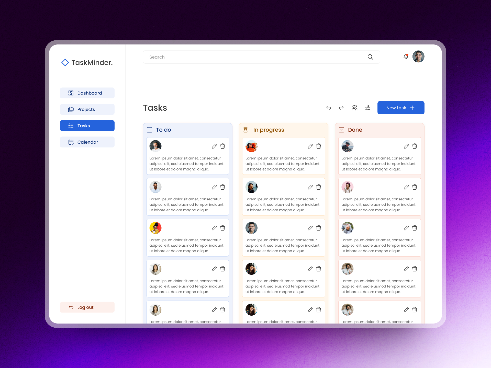

# Laravel Todo Application

## Introduction

This is a simple todo api application built with Laravel 8.


## Prerequisites

Make sure you have the following installed:

- [PHP](https://www.php.net/manual/en/install.php)
- [Composer](https://getcomposer.org/download/)
- [Node.js](https://nodejs.org/)
- [npm](https://www.npmjs.com/get-npm)
- [MySQL](https://dev.mysql.com/downloads/) or another supported database

## Installation

1. **Clone the repository:**

    ```bash
    git clone 
    ```

2. **Navigate to the project directory:**

    ```bash
    cd todo-api
    ```

3. **Install PHP dependencies:**

    ```bash
    composer install
    ```

4. **Install JavaScript dependencies:**

    ```bash
    npm install
    ```

5. **Copy the `.env.example` file to `.env`:**

    ```bash
    cp .env.example .env
    ```

6. **Generate an application key:**

    ```bash
    php artisan key:generate
    ```

7. **Configure your database connection in the `.env` file:**

    ```env
    DB_CONNECTION=mysql
    DB_HOST=your-database-host
    DB_PORT=your-database-port
    DB_DATABASE=your-database-name
    DB_USERNAME=your-database-username
    DB_PASSWORD=your-database-password
    ```

8. **Migrate the database:**

    ```bash
    php artisan migrate
    ```

9. **Seed the database with sample data (including an admin user):**

    ```bash
    php artisan db:seed --class=UsersTableSeeder
    ```

10. **Seed the database with sample blog data :**

    ```bash
    php artisan db:seed
    ```

## Usage

1. **Run the development server:**

    ```bash
    php artisan serve
    ```


## Additional Configuration

No additional configuration is required for basic usage. Customize the application as needed for your specific requirements.

## License

This project is licensed under the MIT License - see the [LICENSE](LICENSE) file for details.
